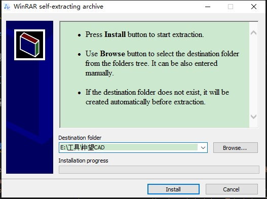
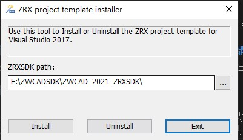
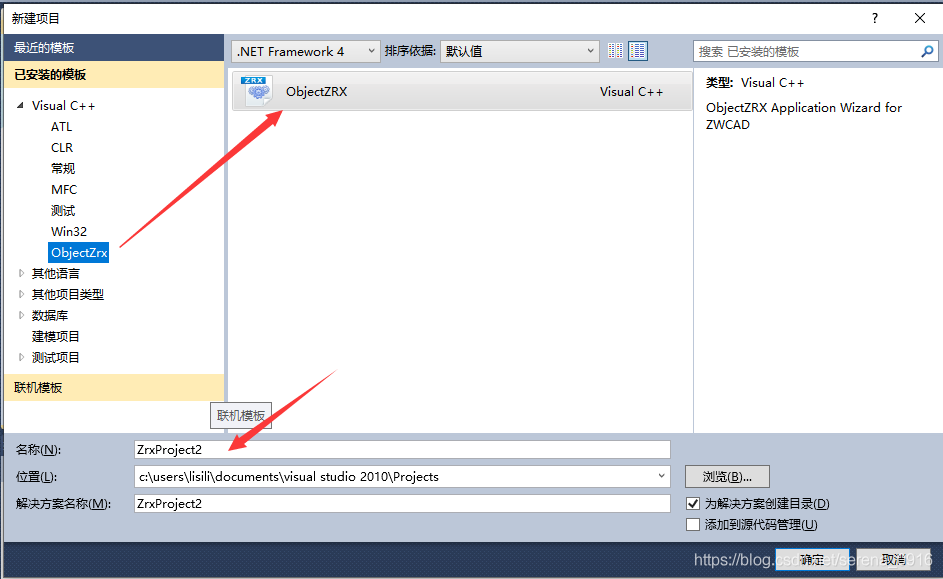
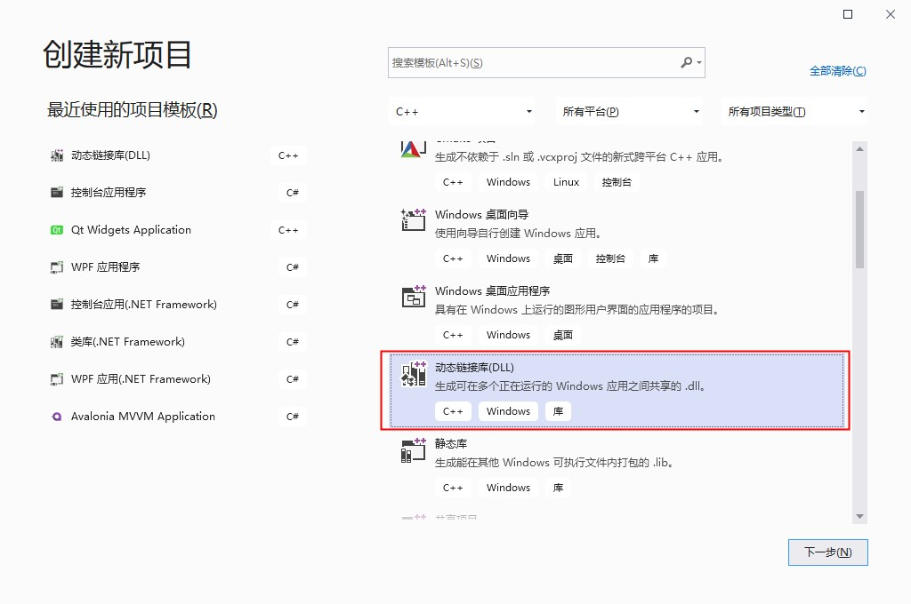
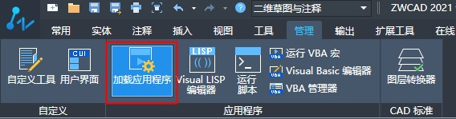

使用c++在中望CAD二次开发步骤

---

<div id="toc"></div>

## 安装SDK

安装最新版本的中望CAD二次开发SDK，我这里安装的是最新的2021版，对应的vs是2017版，2019也是可以用，只是没有项目模板
**注意安装路径一定不能有中文，否则后面引用会出错或者需要全部手动引用**


## 安装项目模板

SDK安装完成之后会自动弹出安装项目模板的窗口，如果你没有弹出可以在你上一步选择的安装目录中找到`ZWCAD_2021_ZRXSDK\Tools\ZRXWizard\ZRXWizardSetup.exe`手动安装

这里的目录就是SDK的安装目录，默认选择就是对的，如果不对请手动选择一下
点击install安装

## 创建项目

### vs2017

如果你是vs2017，到这里就可以了，在创建项目界面选择创建cad项目了


### vs2019

1. 创建动态链接库项目


2. 修改项目文件，以便可以找到到中望CAD的库和头文件，不然就要手动引用很麻烦
在你的项目目录找到项目文件`xxx.vcxproj`，xxx为项目名称，用记事本打开，找到如下代码的位置

```xml
  <ImportGroup Label="PropertySheets" Condition="'$(Configuration)|$(Platform)'=='Debug|Win32'">
    <Import Project="$(UserRootDir)\Microsoft.Cpp.$(Platform).user.props" Condition="exists('$(UserRootDir)\Microsoft.Cpp.$(Platform).user.props')" Label="LocalAppDataPlatform" />
  </ImportGroup>
  <ImportGroup Label="PropertySheets" Condition="'$(Configuration)|$(Platform)'=='Release|Win32'">
    <Import Project="$(UserRootDir)\Microsoft.Cpp.$(Platform).user.props" Condition="exists('$(UserRootDir)\Microsoft.Cpp.$(Platform).user.props')" Label="LocalAppDataPlatform" />
  </ImportGroup>
  <ImportGroup Label="PropertySheets" Condition="'$(Configuration)|$(Platform)'=='Debug|x64'">
    <Import Project="$(UserRootDir)\Microsoft.Cpp.$(Platform).user.props" Condition="exists('$(UserRootDir)\Microsoft.Cpp.$(Platform).user.props')" Label="LocalAppDataPlatform" />
  </ImportGroup>
  <ImportGroup Label="PropertySheets" Condition="'$(Configuration)|$(Platform)'=='Release|x64'">
    <Import Project="$(UserRootDir)\Microsoft.Cpp.$(Platform).user.props" Condition="exists('$(UserRootDir)\Microsoft.Cpp.$(Platform).user.props')" Label="LocalAppDataPlatform" />
  </ImportGroup>
```

**注意Label内容，否则可能找到另一个节点。**

把以上4个节点换成如下代码

```xml
  <ImportGroup Label="PropertySheets" Condition="'$(Configuration)|$(Platform)'=='Debug|Win32'">
    <Import Project="$(UserRootDir)\Microsoft.Cpp.$(Platform).user.props" Condition="exists('$(UserRootDir)\Microsoft.Cpp.$(Platform).user.props')" Label="LocalAppDataPlatform" />
    <Import Project="$(UserRootDir)\zrx2021.props" />
  </ImportGroup>
  <ImportGroup Label="PropertySheets" Condition="'$(Configuration)|$(Platform)'=='Release|Win32'">
    <Import Project="$(UserRootDir)\Microsoft.Cpp.$(Platform).user.props" Condition="exists('$(UserRootDir)\Microsoft.Cpp.$(Platform).user.props')" Label="LocalAppDataPlatform" />
    <Import Project="$(UserRootDir)\zrx2021.props" />
  </ImportGroup>
  <ImportGroup Label="PropertySheets" Condition="'$(Configuration)|$(Platform)'=='Debug|x64'">
    <Import Project="$(UserRootDir)\Microsoft.Cpp.$(Platform).user.props" Condition="exists('$(UserRootDir)\Microsoft.Cpp.$(Platform).user.props')" Label="LocalAppDataPlatform" />
    <Import Project="$(UserRootDir)\zrx2021.props" />
  </ImportGroup>
  <ImportGroup Label="PropertySheets" Condition="'$(Configuration)|$(Platform)'=='Release|x64'">
    <Import Project="$(UserRootDir)\Microsoft.Cpp.$(Platform).user.props" Condition="exists('$(UserRootDir)\Microsoft.Cpp.$(Platform).user.props')" Label="LocalAppDataPlatform" />
    <Import Project="$(UserRootDir)\zrx2021.props" />
  </ImportGroup>
```

主要就是引入zrx2021.props配置，这个文件中保存了中望CAD的库文件和头文件位置。这个文件在我的电脑上路径是`C:\Users\Administrator\AppData\Local\Microsoft\MSBuild\v4.0\zrx2021.props`，Administrator是我的用户名，请换成你自己的用户名。

3. 引入CAD头文件

打开pch.h文件，修改如下：

```cpp
// pch.h: 这是预编译标头文件。
// 下方列出的文件仅编译一次，提高了将来生成的生成性能。
// 这还将影响 IntelliSense 性能，包括代码完成和许多代码浏览功能。
// 但是，如果此处列出的文件中的任何一个在生成之间有更新，它们全部都将被重新编译。
// 请勿在此处添加要频繁更新的文件，这将使得性能优势无效。

#ifndef PCH_H
#define PCH_H

// 添加要在此处预编译的标头
#include "framework.h"

//引入头文件
#include "accmd.h"
#include "AcString.h"
#include "gepnt3d.h"
#include "geassign.h"
#include "dbents.h"
#include "dbmain.h"
#include "acdocman.h"
#include "acarray.h"
#include "adscodes.h"

#endif //PCH_H
```

4. 添加CAD入口文件
新增一个cpp类文件，代码如下

```cpp
#include "pch.h"
#include "tchar.h"
#include <aced.h>
#include <rxregsvc.h>


void helloWorld()
{
    acutPrintf(_T("\nHello World!"));
}
void helloWorld2()
{
    acutPrintf(_T("\nHello World2!"));
}
void initApp()
{
    // register a command with the AutoCAD command mechanism
	acedRegCmds->addCommand(_T("HELLOWORLD_COMMANDS"),
		_T("Hello"),
		_T("Hello"),
		ACRX_CMD_TRANSPARENT,
		helloWorld);
	acedRegCmds->addCommand(_T("HELLOWORLD_COMMANDS"),
		_T("Hello2"),
		_T("Hello2"),
		ACRX_CMD_TRANSPARENT,
		helloWorld2);
}

void unloadApp()
{
	acedRegCmds->removeGroup(_T("HELLOWORLD_COMMANDS"));
}

extern "C" AcRx::AppRetCode
zcrxEntryPoint(AcRx::AppMsgCode msg, void* pkt)
{
	switch (msg)
	{
	case AcRx::kInitAppMsg:
		acrxDynamicLinker->unlockApplication(pkt);
		acrxRegisterAppMDIAware(pkt);
		initApp();
		break;
	case AcRx::kUnloadAppMsg:
		unloadApp();
		break;
	default:
		break;
	}

	return AcRx::kRetOK;
}


#ifdef _WIN64
#pragma comment(linker, "/export:zcrxEntryPoint,PRIVATE")
#pragma comment(linker, "/export:zcrxGetApiVersion,PRIVATE")
#else // WIN32
#pragma comment(linker, "/export:_zcrxEntryPoint,PRIVATE")
#pragma comment(linker, "/export:_zcrxGetApiVersion,PRIVATE")
#endif
```

## 编译

**注意编译的版本要和中望cad版本一致**，也就是中望cad是32位的就要编译成32位的程序，中望cad是64位的就要编译成64位的程序，编译之后在项目目录`\Out\bin`中找到对应版本的程序

## 在中望cad中加载



---

**参考资料**

- [中望CAD二次开发环境配置及使用](https://blog.csdn.net/serena_0916/article/details/91609980)
