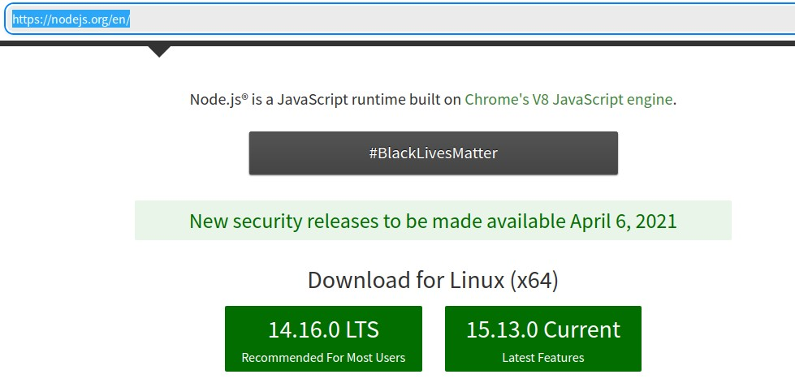

如果你在网上搜uos安装npm，大概率按照那一套下来，最终安装的是5.8版本，不管你怎么更新就是5.8，虽然官网最新版已经是7.8（2021-04-02），如果你遇到了这种情况，请继续看下文，否则这篇文章对你无意义。

---

<div id="toc"></div>

## 下载nodejs

去[官网https://nodejs.org/en/](https://nodejs.org/en/)下载nodejs，如果是用uos系统打开的网站会自动定位到linux版本，否则请手动选择linux版本


## 解压

解压到任意目录，目录中不要含中文，定位到解压的目录，复制目录路径备用


## 增加环境变量

打开终端，在终端中输入如下命令：
`sudo vim /etc/profile`
编辑环境变量文件，在末尾增加如下内容：

```ini
export NODE_HOME=/data/home/tool/node-v14.16.0-linux-x64 #这是上一步复制的路径，去掉前面的file://
export PATH=$PATH:$NODE_HOME/bin
```

输入命令`:wq`保存退出

## 把环境变量更新到系统

输入命令
`source /etc/profile /etc/bash.bashrc `

## 结束

现在再查看nodejs和npm的版本应该就是刚才下载的版本了


---

**参考资料**

- [deepin v20 安装nodejs 和 npm](https://blog.csdn.net/qq_41897021/article/details/107720553)
